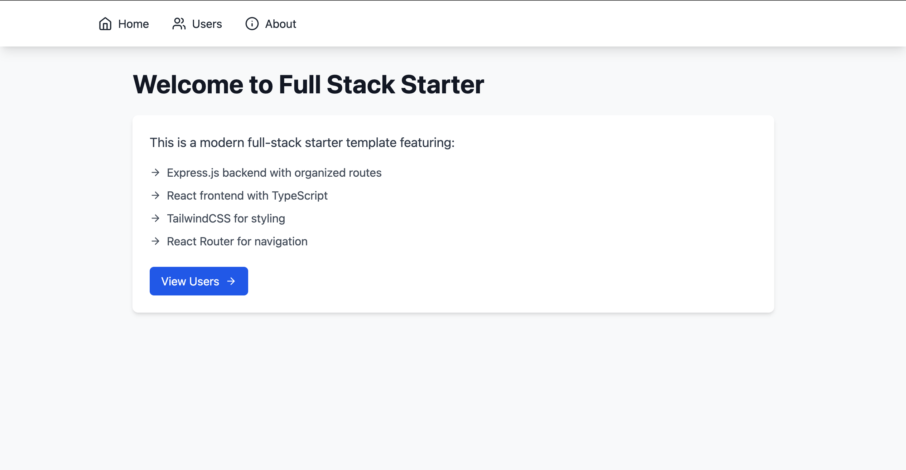

# Node-React-Starter-Pack
This is a Typescript strater template to build quick proof of concepts using Node.js for the server and React.js for the client.

>[!WARNING]
>The repo is architected for speed of prototyping and not for scalability. It is not recommended to use this pattern for production applications.

## Quick Links
1. [Directory Structure](#directory-structure)
2. [Tools Used](#tools-used)
    - [Backend Tools](#backend)
    - [Frontend Tools](#frontend)
3. [Usage](#usage)

## Directory Structure
for the ease of use both backend & frontend are in the same repository. 
1. `backend` - Node.js Express server
2. `frontend` - React.js client

## Tools Used
### Backend
1. Node.js
2. Express.js

### Frontend
1. React.js
2. React Router
3. Tailwind CSS

>[!NOTE]
> React Context API is used for state management in the frontend. A Reducer pattern is used to manage the state.

## Usage
1. Clone the repository
2. Run `npm install` in the root directory
3. Run `npm run dev` to start the server and client concurrently
